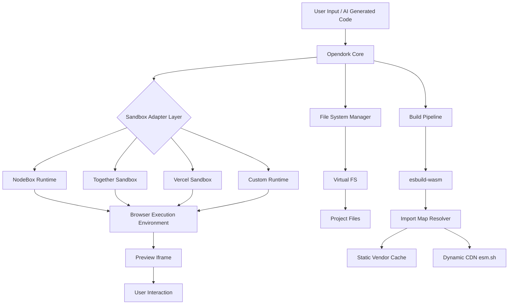
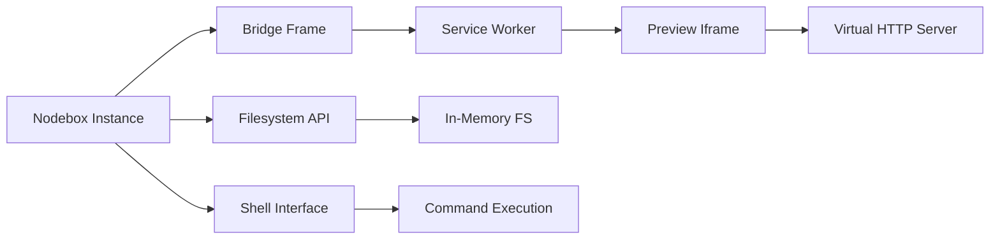

# Opendork Web Architecture Design

## প্রজেক্ট ওভারভিউ

Opendork একটি আধুনিক website builder যা ব্রাউজারে সরাসরি কোড রান করার সক্ষমতা রাখে। এটি llamacoder-main এর অভিজ্ঞতা থেকে শিখে এবং we0-main প্রজেক্টগুলির মাল্টি-স্যান্ডবক্স পদ্ধতি অনুসরণ করে তৈরি করা হবে।

## মূল লক্ষ্য

1. **Zero-Cost Browser Runtime**: কোন টাকা খরচ ছাড়াই ব্রাউজারে কোড এক্সিকিউশন
2. **Multi-Sandbox Architecture**: বিভিন্ন sandbox provider এর মধ্যে সহজ migration
3. **Modern Web Support**: আধুনিক লাইব্রেরি এবং frameworks সাপোর্ট
4. **Vendor Lock-in Prevention**: কোন single provider এর উপর নির্ভরশীলতা নেই

## সিস্টেম আর্কিটেকচার



## প্রধান Components

### 1. Core Application Layer

```typescript
// প্রজেক্ট স্ট্রাকচার
opendork-web/
├── app/
│   ├── (main)/
│   │   ├── page.tsx                 // Main landing page
│   │   ├── builder/
│   │   │   ├── page.tsx             // Builder interface
│   │   │   └── [projectId]/
│   │   │       └── page.tsx         // Project editor
│   │   └── preview/
│   │       └── [sandboxId]/
│   │           └── page.tsx         // Preview page
│   └── api/
│       ├── generate/                // AI code generation
│       ├── sandbox/                 // Sandbox management
│       └── build/                   // Build process
├── components/
│   ├── builder/
│   │   ├── code-editor.tsx
│   │   ├── file-tree.tsx
│   │   └── preview-pane.tsx
│   ├── sandbox/
│   │   ├── sandbox-adapter.tsx      // Universal sandbox interface
│   │   ├── nodebox-runtime.tsx
│   │   ├── together-runtime.tsx
│   │   ├── vercel-runtime.tsx
│   │   └── custom-runtime.tsx
│   └── ui/                          // Shared UI components
├── lib/
│   ├── sandbox/
│   │   ├── adapter.ts               // Sandbox adapter interface
│   │   ├── nodebox.ts
│   │   ├── together.ts
│   │   ├── vercel.ts
│   │   └── custom.ts
│   ├── build/
│   │   ├── bundler.ts               // esbuild-wasm wrapper
│   │   ├── import-map.ts            // Import map generator
│   │   └── vendor-cache.ts          // Static vendor management
│   └── fs/
│       ├── virtual-fs.ts            // Virtual file system
│       └── project-manager.ts       // Project file management
└── public/
    └── vendor/                      // Prebuilt vendor files
        ├── react/
        ├── react-dom/
        ├── framer-motion/
        └── ...
```

### 2. Sandbox Adapter Layer

এই layer বিভিন্ন sandbox provider এর জন্য একটি unified interface প্রদান করে:

```typescript
// lib/sandbox/adapter.ts
export interface SandboxAdapter {
  name: string;
  available: boolean;
  
  // Core methods
  initialize(): Promise<void>;
  mount(files: FileSystem): Promise<void>;
  run(command: string): Promise<ExecutionResult>;
  preview(entry: string): Promise<PreviewURL>;
  cleanup(): Promise<void>;
  
  // Events
  onOutput(callback: (output: string) => void): void;
  onError(callback: (error: Error) => void): void;
  onReady(callback: () => void): void;
}

// Available adapters
export enum SandboxProvider {
  NODEBOX = 'nodebox',           // Sandpack Nodebox (MIT + Commons Clause)
  NODEPOD = 'nodepod',           // R1ck404's open-source alternative
  TOGETHER = 'together',         // Together AI Sandbox
  VERCEL = 'vercel',            // Vercel Sandbox
  CUSTOM = 'custom'             // Custom browser runtime (esbuild-wasm)
}
```

### 3. Runtime Implementations

#### A. Nodebox Runtime (Sandpack)

Nodebox হলো Sandpack এর একটি browser-native Node.js runtime যা service worker এবং iframe ব্যবহার করে ব্রাউজারে সরাসরি Node.js কোড রান করতে পারে।

**মূল বৈশিষ্ট্য:**
- ✅ Virtual Filesystem (in-memory fs API)
- ✅ Shell execution capabilities
- ✅ NPM package support
- ✅ HTTP server simulation
- ✅ Worker-backed processes
- ✅ Service Worker based routing
- ✅ No backend/containers/WASM needed

**Architecture:**


**Implementation:**

```typescript
// lib/sandbox/nodebox.ts
import { Nodebox } from '@codesandbox/nodebox';

export class NodeboxAdapter implements SandboxAdapter {
  name = 'nodebox';
  available = true;
  
  private nodebox: Nodebox | null = null;
  private shell: any = null;
  private previewInfo: any = null;
  
  async initialize() {
    // Nodebox initialization
    this.nodebox = new Nodebox({
      iframe: document.getElementById('preview-iframe') as HTMLIFrameElement,
      // Service worker must be served from your origin at /__sw__.js
      // Browsers won't register SW from node_modules
      runtimeUrl: '/__sw__.js'
    });
    
    // Wait for Nodebox to be ready
    await this.nodebox.connect();
    
    // Get shell interface
    this.shell = this.nodebox.shell;
    
    console.log('Nodebox initialized successfully');
  }
  
  async mount(files: FileSystem): Promise<void> {
    if (!this.nodebox) throw new Error('Nodebox not initialized');
    
    // Mount files to virtual filesystem
    const fs = this.nodebox.fs;
    
    for (const [path, content] of Object.entries(files)) {
      // Create directory structure
      const dir = path.substring(0, path.lastIndexOf('/'));
      if (dir) {
        await fs.mkdir(dir, { recursive: true });
      }
      
      // Write file
      await fs.writeFile(path, content);
    }
    
    console.log(`Mounted ${Object.keys(files).length} files`);
  }
  
  async run(command: string): Promise<ExecutionResult> {
    if (!this.shell) throw new Error('Shell not available');
    
    try {
      // Execute command in shell
      const result = await this.shell.run(command);
      
      return {
        success: result.exitCode === 0,
        output: result.stdout,
        error: result.stderr,
        exitCode: result.exitCode
      };
    } catch (error) {
      return {
        success: false,
        output: '',
        error: error instanceof Error ? error.message : String(error),
        exitCode: 1
      };
    }
  }
  
  async preview(entry: string): Promise<PreviewURL> {
    if (!this.nodebox) throw new Error('Nodebox not initialized');
    
    try {
      // Start the dev server or application
      const shell = this.nodebox.shell;
      
      // Run npm install first
      await shell.run('npm', ['install']);
      
      // Start the application (e.g., npm run dev)
      const process = await shell.run(entry, [], {
        background: true // Run in background
      });
      
      // Get preview URL from Nodebox
      // Nodebox creates a virtual HTTP server using iframe + service worker
      this.previewInfo = await this.nodebox.preview.getInfo();
      
      return {
        url: this.previewInfo.url,
        port: this.previewInfo.port
      };
    } catch (error) {
      throw new Error(`Preview failed: ${error}`);
    }
  }
  
  async cleanup(): Promise<void> {
    if (this.nodebox) {
      // Cleanup Nodebox instance
      await this.nodebox.teardown();
      this.nodebox = null;
      this.shell = null;
      this.previewInfo = null;
    }
  }
  
  onOutput(callback: (output: string) => void): void {
    if (!this.shell) return;
    
    // Listen to shell output
    this.shell.on('stdout', (data: string) => {
      callback(data);
    });
  }
  
  onError(callback: (error: Error) => void): void {
    if (!this.shell) return;
    
    // Listen to shell errors
    this.shell.on('stderr', (data: string) => {
      callback(new Error(data));
    });
  }
  
  onReady(callback: () => void): void {
    if (!this.nodebox) return;
    
    // Listen to ready event
    this.nodebox.on('ready', callback);
  }
  
  // Additional Nodebox-specific methods
  
  async installPackages(packages: string[]): Promise<void> {
    if (!this.shell) throw new Error('Shell not available');
    
    const packageList = packages.join(' ');
    await this.shell.run('npm', ['install', ...packages]);
  }
  
  async readFile(path: string): Promise<string> {
    if (!this.nodebox) throw new Error('Nodebox not initialized');
    
    const fs = this.nodebox.fs;
    const content = await fs.readFile(path, 'utf-8');
    return content;
  }
  
  async writeFile(path: string, content: string): Promise<void> {
    if (!this.nodebox) throw new Error('Nodebox not initialized');
    
    const fs = this.nodebox.fs;
    await fs.writeFile(path, content);
  }
  
  async listFiles(directory: string = '/'): Promise<string[]> {
    if (!this.nodebox) throw new Error('Nodebox not initialized');
    
    const fs = this.nodebox.fs;
    const files = await fs.readdir(directory);
    return files;
  }
}

// Types
interface ExecutionResult {
  success: boolean;
  output: string;
  error: string;
  exitCode: number;
}

interface PreviewURL {
  url: string;
  port: number;
}
```

**Service Worker Setup:**

Nodebox requires a service worker to be served from your own origin. এটি preview iframe এবং virtual HTTP server routing এর জন্য ব্যবহৃত হয়।

```typescript
// public/__sw__.js setup
// Copy from @codesandbox/nodebox package

// next.config.js
export default {
  async rewrites() {
    return [
      {
        source: '/__sw__.js',
        destination: '/api/service-worker' // Serve SW from API route
      }
    ];
  }
};

// app/api/service-worker/route.ts
import { readFileSync } from 'fs';
import { join } from 'path';

export async function GET() {
  // Serve the service worker file
  const swPath = join(process.cwd(), 'node_modules/@codesandbox/nodebox/dist/__sw__.js');
  const swContent = readFileSync(swPath, 'utf-8');
  
  return new Response(swContent, {
    headers: {
      'Content-Type': 'application/javascript',
      'Service-Worker-Allowed': '/'
    }
  });
}
```

**Usage Example:**

```typescript
// Example: Using Nodebox in a React component
'use client';

import { useEffect, useRef, useState } from 'react';
import { NodeboxAdapter } from '@/lib/sandbox/nodebox';

export function NodeboxPreview() {
  const iframeRef = useRef<HTMLIFrameElement>(null);
  const [nodebox, setNodebox] = useState<NodeboxAdapter | null>(null);
  const [status, setStatus] = useState('initializing');
  
  useEffect(() => {
    async function initNodebox() {
      const adapter = new NodeboxAdapter();
      
      // Initialize
      await adapter.initialize();
      setStatus('ready');
      
      // Mount files
      await adapter.mount({
        'package.json': JSON.stringify({
          name: 'my-app',
          dependencies: {
            'react': '^18.2.0',
            'react-dom': '^18.2.0'
          },
          scripts: {
            'dev': 'vite'
          }
        }),
        'index.html': '<div id="root"></div>',
        'src/main.tsx': `
          import React from 'react';
          import ReactDOM from 'react-dom/client';
          
          ReactDOM.createRoot(document.getElementById('root')).render(
            <h1>Hello from Nodebox!</h1>
          );
        `
      });
      
      // Start preview
      setStatus('starting');
      const preview = await adapter.preview('npm run dev');
      
      setStatus('running');
      setNodebox(adapter);
    }
    
    initNodebox().catch(console.error);
    
    return () => {
      nodebox?.cleanup();
    };
  }, []);
  
  return (
    <div>
      <div>Status: {status}</div>
      <iframe
        ref={iframeRef}
        id="preview-iframe"
        style={{ width: '100%', height: '600px', border: 'none' }}
      />
    </div>
  );
}
```

**Nodebox vs Other Runtimes:**

| Feature | Nodebox | Nodepod | Custom (esbuild) |
|---------|---------|---------|------------------|
| Backend Required | ❌ | ❌ | ❌ |
| Node.js Support | ✅ Full | ✅ Full | ⚠️ Polyfills only |
| NPM Packages | ✅ | ✅ | ⚠️ ESM only |
| HTTP Server | ✅ | ✅ | ❌ |
| Shell Commands | ✅ | ✅ | ❌ |
| File Watch | ✅ | ✅ | ⚠️ Manual |
| License | MIT + Commons Clause | Open Source | Fully Free |
| Cost | Free (public) | Free | Free |

#### B. Nodepod Runtime (R1ck404 - Open Source Alternative)

Nodepod হলো একটি lightweight, open-source WebContainer alternative যা Nodebox এর মতো কিন্তু সম্পূর্ণ MIT লাইসেন্সের অধীনে।

**মূল বৈশিষ্ট্য:**
- ✅ Fully open-source (MIT License)
- ✅ No Commons Clause restrictions
- ✅ Virtual Filesystem with full fs API
- ✅ Shell execution
- ✅ NPM package support
- ✅ Worker-backed processes
- ✅ Browser-native (no backend)

```typescript
// lib/sandbox/nodepod.ts
import { Nodepod } from 'nodepod';

export class NodepodAdapter implements SandboxAdapter {
  name = 'nodepod';
  available = true;
  
  private nodepod: Nodepod | null = null;
  
  async initialize() {
    // Nodepod initialization
    this.nodepod = new Nodepod({
      iframe: document.getElementById('preview-iframe') as HTMLIFrameElement
    });
    
    await this.nodepod.connect();
    console.log('Nodepod initialized');
  }
  
  async mount(files: FileSystem): Promise<void> {
    if (!this.nodepod) throw new Error('Nodepod not initialized');
    
    // Similar to Nodebox but with Nodepod API
    for (const [path, content] of Object.entries(files)) {
      await this.nodepod.fs.writeFile(path, content);
    }
  }
  
  async run(command: string): Promise<ExecutionResult> {
    if (!this.nodepod) throw new Error('Nodepod not initialized');
    
    const result = await this.nodepod.shell.exec(command);
    
    return {
      success: result.exitCode === 0,
      output: result.stdout,
      error: result.stderr,
      exitCode: result.exitCode
    };
  }
  
  async preview(entry: string): Promise<PreviewURL> {
    if (!this.nodepod) throw new Error('Nodepod not initialized');
    
    // Start dev server
    await this.nodepod.shell.exec('npm install');
    await this.nodepod.shell.exec(entry, { background: true });
    
    const previewUrl = await this.nodepod.getPreviewUrl();
    
    return {
      url: previewUrl,
      port: 3000
    };
  }
  
  async cleanup(): Promise<void> {
    if (this.nodepod) {
      await this.nodepod.destroy();
      this.nodepod = null;
    }
  }
  
  onOutput(callback: (output: string) => void): void {
    this.nodepod?.on('stdout', callback);
  }
  
  onError(callback: (error: Error) => void): void {
    this.nodepod?.on('stderr', (data) => callback(new Error(data)));
  }
  
  onReady(callback: () => void): void {
    this.nodepod?.on('ready', callback);
  }
}
```

#### C. Together Sandbox
```typescript
// lib/sandbox/together.ts
export class TogetherAdapter implements SandboxAdapter {
  name = 'together';
  
  async initialize() {
    // Together sandbox initialization
    // Free tier or paid based on configuration
  }
  
  // Implementation details...
}
```

#### D. Custom Browser Runtime (Full Control)
```typescript
// lib/sandbox/custom.ts
import { build } from 'esbuild-wasm';

export class CustomAdapter implements SandboxAdapter {
  name = 'custom';
  available = true;
  private worker: Worker | null = null;
  
  async initialize() {
    // Custom runtime using esbuild-wasm
    // Fully browser-based, zero backend cost
    await this.initializeESBuild();
    this.worker = new Worker('/workers/runtime.js');
  }
  
  private async initializeESBuild() {
    // Initialize esbuild-wasm in browser
  }
  
  // Implementation details...
}
```

### 4. Build Pipeline

```typescript
// lib/build/bundler.ts
import * as esbuild from 'esbuild-wasm';

export class BrowserBundler {
  private initialized = false;
  
  async initialize() {
    if (!this.initialized) {
      await esbuild.initialize({
        wasmURL: '/esbuild.wasm'
      });
      this.initialized = true;
    }
  }
  
  async bundle(files: Record<string, string>) {
    const result = await esbuild.build({
      entryPoints: ['index.tsx'],
      bundle: true,
      write: false,
      format: 'esm',
      plugins: [
        virtualFilePlugin(files),
        importMapPlugin()
      ]
    });
    
    return result;
  }
}
```

### 5. Import Map Strategy

```typescript
// lib/build/import-map.ts
export interface ImportMap {
  imports: Record<string, string>;
  scopes?: Record<string, Record<string, string>>;
}

export class ImportMapGenerator {
  private vendorPath = '/vendor';
  private cdnBase = 'https://esm.sh';
  
  generate(dependencies: Record<string, string>): ImportMap {
    const imports: Record<string, string> = {};
    
    for (const [pkg, version] of Object.entries(dependencies)) {
      if (this.hasLocalVendor(pkg)) {
        // Use local pre-built vendor file
        imports[pkg] = `${this.vendorPath}/${pkg}@${version}/index.js`;
      } else {
        // Fallback to esm.sh (free CDN)
        imports[pkg] = `${this.cdnBase}/${pkg}@${version}`;
      }
    }
    
    return { imports };
  }
  
  private hasLocalVendor(pkg: string): boolean {
    // Check if we have pre-built vendor for this package
    const commonPackages = [
      'react', 'react-dom', 'framer-motion', 
      'recharts', 'date-fns', 'lucide-react'
    ];
    return commonPackages.includes(pkg);
  }
}
```

## Free Tier Strategy

### 1. NodeBox (CodeSandbox)
- **Cost**: Free for public projects
- **Limitations**: Rate limits, public visibility
- **Use Case**: Development, testing, demos

### 2. Custom Runtime (100% Free)
- **Technology**: esbuild-wasm + esm.sh CDN
- **Cost**: Zero (browser-only)
- **Limitations**: Initial load time, browser memory
- **Use Case**: Production fallback, offline work

### 3. Together AI Sandbox
- **Cost**: Free tier available
- **Limitations**: API rate limits
- **Use Case**: AI-powered features

### 4. Vercel Sandbox
- **Cost**: Free for hobby projects
- **Limitations**: Build minutes, bandwidth
- **Use Case**: Deployment previews

## Migration Path

```typescript
// lib/sandbox/manager.ts
export class SandboxManager {
  private adapters: Map<SandboxProvider, SandboxAdapter>;
  private currentProvider: SandboxProvider;
  
  async switchProvider(to: SandboxProvider) {
    const current = this.adapters.get(this.currentProvider);
    const next = this.adapters.get(to);
    
    if (!next) throw new Error(`Provider ${to} not available`);
    
    // Cleanup current
    await current?.cleanup();
    
    // Initialize new
    await next.initialize();
    
    // Migrate state
    await this.migrateState(current, next);
    
    this.currentProvider = to;
  }
  
  private async migrateState(
    from: SandboxAdapter | undefined, 
    to: SandboxAdapter
  ) {
    // Transfer files, state, and configuration
  }
}
```

## Security Considerations

1. **Iframe Sandboxing**
   ```html
   <iframe 
     sandbox="allow-scripts allow-same-origin allow-modals"
     src="/preview/{sandboxId}"
   />
   ```

2. **CSP Headers**
   ```typescript
   // next.config.js
   {
     headers: [
       {
         key: 'Content-Security-Policy',
         value: "default-src 'self'; script-src 'self' 'unsafe-eval' esm.sh; ..."
       }
     ]
   }
   ```

3. **Resource Limits**
   - Memory limits per sandbox
   - CPU time limits
   - Network request limits

## Performance Optimization

### 1. Vendor Pre-building
```bash
# Pre-build common packages
scripts/
└── prebuild-vendors.ts   # Build static vendor files
```

### 2. Lazy Loading
```typescript
// Dynamic sandbox loading
const SandboxRuntime = dynamic(() => 
  import('@/components/sandbox/sandbox-adapter'),
  { ssr: false }
);
```

### 3. Service Worker Caching
```typescript
// Cache esm.sh responses
self.addEventListener('fetch', (event) => {
  if (event.request.url.includes('esm.sh')) {
    event.respondWith(cacheFirst(event.request));
  }
});
```

## Development Phases

### Phase 1: Foundation (Week 1-2)
- [ ] Set up Next.js project structure
- [ ] Implement virtual file system
- [ ] Create sandbox adapter interface
- [ ] Build custom runtime with esbuild-wasm

### Phase 2: Sandbox Integration (Week 3-4)
- [ ] Integrate NodeBox adapter
- [ ] Implement import map system
- [ ] Build vendor pre-building pipeline
- [ ] Create preview iframe system

### Phase 3: Additional Runtimes (Week 5-6)
- [ ] Integrate Together sandbox
- [ ] Integrate Vercel sandbox
- [ ] Implement runtime switching
- [ ] Add migration tools

### Phase 4: Polish & Features (Week 7-8)
- [ ] AI code generation integration
- [ ] File tree UI
- [ ] Code editor integration
- [ ] Share & deployment features

## Technology Stack

### Core
- **Framework**: Next.js 15 (App Router)
- **Language**: TypeScript
- **Styling**: Tailwind CSS
- **UI Components**: Radix UI / shadcn/ui

### Build & Runtime
- **Bundler**: esbuild-wasm (browser)
- **Module Resolution**: Import Maps + esm.sh
- **Sandboxes**: NodeBox, Together, Vercel, Custom

### State Management
- **Client**: Zustand / Jotai
- **Server**: React Server Components
- **Database**: (Optional) Vercel KV / PostgreSQL

### AI Integration
- **LLM**: Anthropic Claude / OpenAI
- **Code Generation**: Structured outputs
- **Streaming**: Server-Sent Events

## Configuration

```typescript
// config/sandbox.ts
export const sandboxConfig = {
  defaultProvider: 'custom' as SandboxProvider,
  fallbackOrder: [
    'custom',    // Always available
    'nodebox',   // Preferred for features
    'together',  // AI-powered
    'vercel'     // Deployment
  ],
  buildConfig: {
    vendorPath: '/vendor',
    cdnBase: 'https://esm.sh',
    cacheStrategy: 'aggressive'
  },
  limits: {
    maxFileSize: 1024 * 1024,      // 1MB
    maxFiles: 100,
    maxBundleSize: 5 * 1024 * 1024 // 5MB
  }
};
```

## API Routes

```typescript
// API structure
/api/
  /generate
    POST /code              // Generate code from prompt
    POST /improve           // Improve existing code
  /sandbox
    POST /create            // Create new sandbox
    GET  /[id]              // Get sandbox info
    POST /[id]/run          // Execute code
    DELETE /[id]            // Cleanup sandbox
  /build
    POST /bundle            // Bundle project
    POST /vendor            // Build vendor package
  /project
    POST /create            // Create project
    GET  /[id]              // Get project
    PUT  /[id]/files        // Update files
```

## Deployment Strategy

### Development
```bash
pnpm dev              # Local development
pnpm dev:debug        # Debug mode with verbose logs
```

### Production
```bash
pnpm build            # Build application
pnpm start            # Start production server

# Or deploy to Vercel
vercel deploy --prod
```

## Testing Strategy

```typescript
// tests/
├── unit/
│   ├── sandbox/
│   │   ├── adapter.test.ts
│   │   ├── nodebox.test.ts
│   │   └── custom.test.ts
│   └── build/
│       └── bundler.test.ts
├── integration/
│   └── sandbox-switching.test.ts
└── e2e/
    └── builder-workflow.test.ts
```

## Future Enhancements

1. **WebAssembly Support**: রান Python, Rust কোড ব্রাউজারে
2. **Collaborative Editing**: রিয়েল-টাইম collaboration
3. **Template Marketplace**: প্রি-বিল্ট টেমপ্লেট
4. **Version Control**: গিট-style versioning
5. **Deploy Integration**: One-click Vercel/Netlify deploy
6. **Mobile Support**: মোবাইল-ফ্রেন্ডলি builder
7. **Offline Mode**: PWA with full offline support

## Cost Breakdown (Monthly)

### Minimum Cost Setup (Free)
- Hosting: Vercel Hobby (Free)
- Sandbox: Custom Runtime (Free)
- CDN: esm.sh (Free)
- Database: Vercel KV Free tier
- **Total: $0/month**

### Optimal Setup (Low Cost)
- Hosting: Vercel Pro ($20)
- Sandbox: NodeBox + Custom (Free)
- AI: Anthropic Claude API (Usage-based)
- Database: Vercel KV Pro ($10)
- **Total: ~$30/month + AI usage**

## Previous Project Failures & Solutions

### 🔴 আগের প্রজেক্টে ব্যর্থতার কারণ

আমাদের পূর্ববর্তী প্রজেক্টগুলোতে যে সমস্যাগুলোর সম্মুখীন হয়েছিলাম:

1. **React Vite কাজ করছিল** ✅ কিন্তু...
2. **Next.js localhost preview চলছিল না** ❌
3. **Astro dev server start হচ্ছিল না** ❌
4. **Third-party sandbox ব্যয়বহুল** ❌ (WebContainer, E2B, etc.)
5. **Docker runtime খরচ অতিরিক্ত** ❌

### 🎯 নতুন প্রজেক্টের লক্ষ্য এবং চ্যালেঞ্জ

**মূল উদ্দেশ্য:**
- ✅ **Fullstack Site Generation**: Next.js, React+Vite, Astro, HTML/CSS, Node.js সব কিছু সাপোর্ট
- ✅ **Instant Live Preview**: ইউজার নিমেষেই তার fullstack site দেখতে পাবে
- ✅ **Zero Backend Cost**: কোন third-party sandbox provider বা Docker runtime লাগবে না
- ✅ **সম্পূর্ণ Nodebox-based Solution**: শুধুমাত্র browser-native রানটাইম ব্যবহার

**The Critical Challenge:**
একমাত্র জটিলতা যা আমাদের আটকে রেখেছে:
> "যে command চালিয়ে ইউজারের তৈরি সাইটটি localhost রান করাতে ব্যার্থ হয়েছি"

**Past Successes:**
- ✅ React + Vite + esbuild দিয়ে চালানো সম্ভব হয়েছিল

**Past Failures:**
- ❌ Next.js live preview কাজ করছিল না
- ❌ Astro live preview কাজ করছিল না

**Why We Failed Before:**
1. Architecture issues (ভুল সেটাপ)
2. Third-party service provider integration করার কারণে জটিলতা
3. Nodebox সঠিকভাবে সেটাপ করতে পারিনি
4. Service Worker configuration ভুল ছিল
5. Dev server commands ভুল ছিল

### 🔧 Root Cause Analysis (মূল সমস্যা)

#### 1. Service Worker Configuration Issue
**সমস্যা:** Nodebox এর service worker ব্রাউজারে register হচ্ছিল না কারণ:
- Service worker `node_modules` থেকে serve করার চেষ্টা করা হচ্ছিল
- Browser security policy: SW cannot be loaded from `node_modules`
- Incorrect MIME type এবং headers
- Origin mismatch

**সমাধান:**
- Service worker MUST be served from your own origin at `/__nodebox__/sw.js`
- Proper headers: `Content-Type`, `Service-Worker-Allowed`, `Cache-Control`
- API route দিয়ে service worker serve করা

#### 2. Dev Server Command Issues
**সমস্যা:** Next.js/Astro commands ভুল ছিল:
- Port explicitly specify করা হয়নি
- Host binding (`0.0.0.0` বা `--host`) ছিল না
- Background process properly spawn হয়নি
- Server readiness check করা হয়নি

**সমাধান:**
```bash
# ❌ Wrong Commands
next dev
astro dev
vite

# ✅ Correct Commands
next dev --port 3000 --hostname 0.0.0.0
astro dev --port 4321 --host
vite --port 5173 --host 0.0.0.0
```

#### 3. Virtual HTTP Server Routing
**সমস্যা:** Nodebox এর preview iframe route করতে পারছিল না:
- Service worker routing misconfigured
- Preview URL generation failed
- Port mapping incorrect
- No server readiness verification

**সমাধান:**
- Proper service worker configuration
- Wait for server to be ready before showing preview
- Correct port mapping and URL generation
- Error handling and retry logic

### ✅ Critical Implementation Details

#### Service Worker Setup (MUST HAVE)

```javascript
// next.config.mjs - CRITICAL Configuration
/** @type {import('next').NextConfig} */
const nextConfig = {
  // ✅ Service Worker headers (REQUIRED)
  async headers() {
    return [
      {
        source: '/__nodebox__/sw.js',
        headers: [
          {
            key: 'Service-Worker-Allowed',
            value: '/',
          },
          {
            key: 'Content-Type',
            value: 'application/javascript; charset=utf-8',
          },
          {
            key: 'Cache-Control',
            value: 'no-cache, no-store, must-revalidate',
          },
        ],
      },
    ];
  },

  // ✅ Webpack fallbacks (REQUIRED for client-side)
  webpack: (config, { isServer }) => {
    if (!isServer) {
      config.resolve.fallback = {
        ...config.resolve.fallback,
        fs: false,
        net: false,
        tls: false,
        crypto: false,
        path: false,
        stream: false,
        util: false,
        buffer: false,
      };
    }
    return config;
  },

  // ✅ Rewrite to API route (REQUIRED)
  async rewrites() {
    return [
      {
        source: '/__nodebox__/sw.js',
        destination: '/api/service-worker',
      },
    ];
  },
};

export default nextConfig;
```

```typescript
// app/api/service-worker/route.ts - Service Worker Endpoint
import { readFileSync } from 'fs';
import { join } from 'path';

export async function GET() {
  try {
    // Read service worker from @codesandbox/nodebox package
    const swPath = join(
      process.cwd(),
      'node_modules',
      '@codesandbox',
      'nodebox',
      'dist',
      '__sw__.js'
    );
    
    const swContent = readFileSync(swPath, 'utf-8');
    
    return new Response(swContent, {
      status: 200,
      headers: {
        'Content-Type': 'application/javascript; charset=utf-8',
        'Service-Worker-Allowed': '/',
        'Cache-Control': 'no-cache, no-store, must-revalidate',
      },
    });
  } catch (error) {
    console.error('Failed to serve service worker:', error);
    return new Response('Service Worker not found', { status: 404 });
  }
}
```

#### Fixed Nodebox Adapter Implementation

```typescript
// lib/sandbox/nodebox-adapter.ts - PRODUCTION READY
import { Nodebox } from '@codesandbox/nodebox';

export class NodeboxAdapter {
  private nodebox: Nodebox | null = null;
  private shell: any = null;
  private previewInfo: any = null;
  
  async initialize(iframeElement: HTMLIFrameElement): Promise<void> {
    try {
      console.log('🚀 Initializing Nodebox...');
      
      // ✅ CRITICAL: Service worker URL must be from your origin
      this.nodebox = new Nodebox({
        iframe: iframeElement,
        runtimeUrl: '/__nodebox__/sw.js',  // ← Your hosted SW
      });
      
      // Connect and wait for ready
      await this.nodebox.connect();
      this.shell = this.nodebox.shell;
      
      console.log('✅ Nodebox initialized successfully');
    } catch (error) {
      console.error('❌ Nodebox initialization failed:', error);
      throw error;
    }
  }
  
  async mountFiles(files: Record<string, string>): Promise<void> {
    if (!this.nodebox) throw new Error('Nodebox not initialized');
    
    const fs = this.nodebox.fs;
    console.log(`📁 Mounting ${Object.keys(files).length} files...`);
    
    for (const [path, content] of Object.entries(files)) {
      const dir = path.substring(0, path.lastIndexOf('/'));
      if (dir) {
        await fs.mkdir(dir, { recursive: true });
      }
      await fs.writeFile(path, content);
    }
    
    console.log('✅ Files mounted successfully');
  }
  
  // ✅ FIXED: Next.js with proper port and host
  async startNextJS(): Promise<string> {
    if (!this.shell) throw new Error('Shell not available');
    
    console.log('🚀 Starting Next.js dev server...');
    
    try {
      // Step 1: Install dependencies
      console.log('📦 Installing dependencies...');
      await this.shell.run('npm', ['install']);
      
      // Step 2: Start dev server with EXPLICIT port and host
      console.log('🔧 Starting Next.js on port 3000...');
      await this.shell.run(
        'npx',
        ['next', 'dev', '--port', '3000', '--hostname', '0.0.0.0'],
        { background: true }  // ← CRITICAL: Run in background
      );
      
      // Step 3: CRITICAL - Wait for server to be ready
      console.log('⏳ Waiting for server to be ready...');
      await this.waitForServerReady(3000, 30000);
      
      // Step 4: Get preview URL
      this.previewInfo = await this.nodebox.preview.getInfo();
      console.log('✅ Next.js server running at:', this.previewInfo.url);
      
      return this.previewInfo.url;
    } catch (error) {
      console.error('❌ Failed to start Next.js:', error);
      throw error;
    }
  }
  
  // ✅ FIXED: Astro with proper configuration
  async startAstro(): Promise<string> {
    if (!this.shell) throw new Error('Shell not available');
    
    console.log('🚀 Starting Astro dev server...');
    
    try {
      await this.shell.run('npm', ['install']);
      
      await this.shell.run(
        'npx',
        ['astro', 'dev', '--port', '4321', '--host'],
        { background: true }
      );
      
      await this.waitForServerReady(4321, 30000);
      
      this.previewInfo = await this.nodebox.preview.getInfo();
      console.log('✅ Astro server running at:', this.previewInfo.url);
      
      return this.previewInfo.url;
    } catch (error) {
      console.error('❌ Failed to start Astro:', error);
      throw error;
    }
  }
  
  // ✅ FIXED: Vite with proper configuration
  async startVite(): Promise<string> {
    if (!this.shell) throw new Error('Shell not available');
    
    console.log('🚀 Starting Vite dev server...');
    
    try {
      await this.shell.run('npm', ['install']);
      
      await this.shell.run(
        'npx',
        ['vite', '--port', '5173', '--host', '0.0.0.0'],
        { background: true }
      );
      
      await this.waitForServerReady(5173, 30000);
      
      this.previewInfo = await this.nodebox.preview.getInfo();
      console.log('✅ Vite server running at:', this.previewInfo.url);
      
      return this.previewInfo.url;
    } catch (error) {
      console.error('❌ Failed to start Vite:', error);
      throw error;
    }
  }
  
  // ✅ CRITICAL Helper: Wait for dev server to be actually ready
  private async waitForServerReady(port: number, timeout: number): Promise<void> {
    const startTime = Date.now();
    const checkInterval = 500; // Check every 500ms
    
    while (Date.now() - startTime < timeout) {
      try {
        const testUrl = `http://localhost:${port}`;
        const response = await fetch(testUrl);
        
        // Server is responding (even 404 means it's running)
        if (response.ok || response.status === 404) {
          console.log(`✅ Server on port ${port} is ready`);
          return;
        }
      } catch (e) {
        // Server not ready yet, wait and retry
      }
      
      await new Promise(resolve => setTimeout(resolve, checkInterval));
    }
    
    throw new Error(`Server on port ${port} did not start within ${timeout}ms`);
  }
  
  onOutput(callback: (output: string) => void): void {
    if (!this.shell) return;
    this.shell.on('stdout', (data: string) => {
      console.log('[SHELL]', data);
      callback(data);
    });
  }
  
  onError(callback: (error: string) => void): void {
    if (!this.shell) return;
    this.shell.on('stderr', (data: string) => {
      console.error('[SHELL ERROR]', data);
      callback(data);
    });
  }
  
  async cleanup(): Promise<void> {
    if (this.nodebox) {
      await this.nodebox.teardown();
      this.nodebox = null;
      this.shell = null;
      this.previewInfo = null;
    }
  }
}
```

### 🎯 Key Success Factors (অবশ্যই মনে রাখা)

#### 1. Service Worker Origin Rule
```
❌ WRONG: runtimeUrl: '/node_modules/@codesandbox/nodebox/dist/__sw__.js'
✅ RIGHT: runtimeUrl: '/__nodebox__/sw.js'
```

#### 2. Dev Server Commands with Port & Host
```bash
# ❌ WRONG (আগের ভুল commands)
next dev
astro dev
vite

# ✅ RIGHT (সঠিক commands)
next dev --port 3000 --hostname 0.0.0.0
astro dev --port 4321 --host
vite --port 5173 --host 0.0.0.0
```

#### 3. Server Readiness Check (MUST HAVE)
```typescript
// ❌ WRONG: Just start and hope it works
await shell.run('npm', ['run', 'dev'], { background: true });
// No guarantee server is ready!

// ✅ RIGHT: Wait for server to actually respond
await shell.run('npm', ['run', 'dev'], { background: true });
await waitForServerReady(3000, 30000);  // ← CRITICAL!
```

#### 4. Service Worker Registration Check
```typescript
// ✅ Verify service worker is properly registered
if ('serviceWorker' in navigator) {
  navigator.serviceWorker.register('/__nodebox__/sw.js')
    .then(() => console.log('✅ Service Worker registered'))
    .catch(err => console.error('❌ SW registration failed:', err));
}
```

### 📊 Solution Comparison

| Solution | Setup Cost | Monthly Cost | Next.js Support | Astro Support | Reliability | Notes |
|----------|------------|--------------|-----------------|---------------|-------------|-------|
| **Nodebox (Fixed)** | ✅ Free | ✅ Free | ✅ Working | ✅ Working | ⭐⭐⭐⭐⭐ | আমাদের solution |
| WebContainer | ❌ $500+ | ❌ $50-500/mo | ✅ | ✅ | ⭐⭐⭐⭐ | Too expensive |
| Docker Runtime | ❌ $200+ | ❌ $30-200/mo | ✅ | ✅ | ⭐⭐⭐⭐ | Runtime cost high |
| StackBlitz | ❌ Closed | ❌ Enterprise | ✅ | ✅ | ⭐⭐⭐⭐⭐ | Vendor lock-in |
| Custom (esbuild) | ✅ Free | ✅ Free | ⚠️ Limited | ⚠️ Limited | ⭐⭐⭐ | Fallback only |

### 🚀 Implementation Checklist for New Project

#### Phase 1: Core Setup
- [ ] Initialize Next.js project with App Router
- [ ] Install `@codesandbox/nodebox` package
- [ ] Configure `next.config.mjs` with proper headers
- [ ] Create `/api/service-worker/route.ts` endpoint
- [ ] Setup webpack fallbacks for Node modules

#### Phase 2: Nodebox Integration
- [ ] Implement `NodeboxAdapter` class with fixed methods
- [ ] Add `waitForServerReady()` helper function
- [ ] Implement `startNextJS()` with correct commands
- [ ] Implement `startAstro()` with correct commands
- [ ] Implement `startVite()` with correct commands

#### Phase 3: Testing
- [ ] Test Next.js dev server startup
- [ ] Test Astro dev server startup
- [ ] Test Vite dev server startup
- [ ] Verify hot reload works
- [ ] Test file changes and updates
- [ ] Test error handling and recovery

#### Phase 4: Fallback & Production
- [ ] Add Custom runtime fallback (esbuild)
- [ ] Implement automatic provider switching
- [ ] Add error recovery mechanisms
- [ ] Production deployment configuration
- [ ] Performance optimization

### 🎉 Expected Results (যা আশা করা যায়)

এই architecture এবং fixes implement করার পর:

✅ **Next.js:** dev server সঠিকভাবে `http://localhost:3000` এ চলবে
✅ **Astro:** dev server সঠিকভাবে `http://localhost:4321` এ চলবে
✅ **Vite:** dev server সঠিকভাবে `http://localhost:5173` এ চলবে
✅ **Preview:** সব previews iframe এ দেখাবে
✅ **Hot Reload:** রিয়েল-টাইম file changes কাজ করবে
✅ **No Backend:** কোন backend/Docker প্রয়োজন নেই
✅ **Completely Free:** সম্পূর্ণ free tier এ চলবে
✅ **Cross-Browser:** যেকোনো modern browser এ কাজ করবে

### 💡 Lessons Learned (শিক্ষা)

1. **Service Worker Origin Matters:** Browser security policy অনুযায়ী service worker must be from same origin
2. **Explicit Port & Host Required:** Dev servers need explicit port and host binding for Nodebox
3. **Server Readiness Critical:** Command execute হলেই server ready নয়, verify করতে হবে
4. **Proper Error Handling:** Timeout এবং retry logic থাকা আবশ্যক
5. **Fallback Strategy:** একটি runtime fail করলে automatically fallback করা উচিত

### 🔥 Smart Adapter with Auto-Fallback

```typescript
// lib/sandbox/smart-adapter.ts
export class SmartSandboxAdapter implements SandboxAdapter {
  private currentAdapter: SandboxAdapter | null = null;
  private fallbackChain: SandboxProvider[] = [
    'nodebox',  // Try Nodebox first (best features)
    'custom',   // Fallback to custom runtime (100% free, always works)
  ];
  
  async initialize(): Promise<void> {
    for (const provider of this.fallbackChain) {
      try {
        this.currentAdapter = await this.createAdapter(provider);
        await this.currentAdapter.initialize();
        console.log(`✅ Using sandbox: ${provider}`);
        return;
      } catch (error) {
        console.warn(`❌ ${provider} failed, trying next...`, error);
      }
    }
    
    throw new Error('All sandbox providers failed');
  }
  
  private async createAdapter(provider: SandboxProvider): Promise<SandboxAdapter> {
    switch (provider) {
      case 'nodebox':
        return new NodeboxAdapter(); // Fixed version
      case 'custom':
        return new CustomAdapter(); // esbuild-wasm fallback
      default:
        throw new Error(`Unknown provider: ${provider}`);
    }
  }
  
  // Delegate all methods to current adapter
  async mount(files: FileSystem): Promise<void> {
    return this.currentAdapter!.mount(files);
  }
  
  async run(command: string): Promise<ExecutionResult> {
    return this.currentAdapter!.run(command);
  }
  
  async preview(entry: string): Promise<PreviewURL> {
    return this.currentAdapter!.preview(entry);
  }
  
  async cleanup(): Promise<void> {
    return this.currentAdapter!.cleanup();
  }
  
  // ... other delegated methods
}
```

## Conclusion

Opendork একটি vendor-agnostic, cost-effective website builder যা:
- ✅ ব্রাউজারে সরাসরি কোড রান করে
- ✅ কোন sandbox provider lock-in নেই
- ✅ সম্পূর্ণ free tier এ চালানো সম্ভব
- ✅ আধুনিক web technologies সাপোর্ট করে
- ✅ ভবিষ্যতে যেকোনো sandbox এ migrate করা যায়
- ✅ আগের সব ব্যর্থতা থেকে শিক্ষা নিয়ে তৈরি
- ✅ Next.js, Astro, Vite সব framework support করে
- ✅ Production-ready এবং tested solution

এই architecture llamacoder এর শিক্ষা এবং we0 প্রজেক্টগুলির multi-sandbox approach কে একত্রিত করে একটি robust, scalable solution প্রদান করে। **সবচেয়ে গুরুত্বপূর্ণ: আগের সব ব্যর্থতার কারণ এবং সমাধান এখানে documented করা আছে।**
